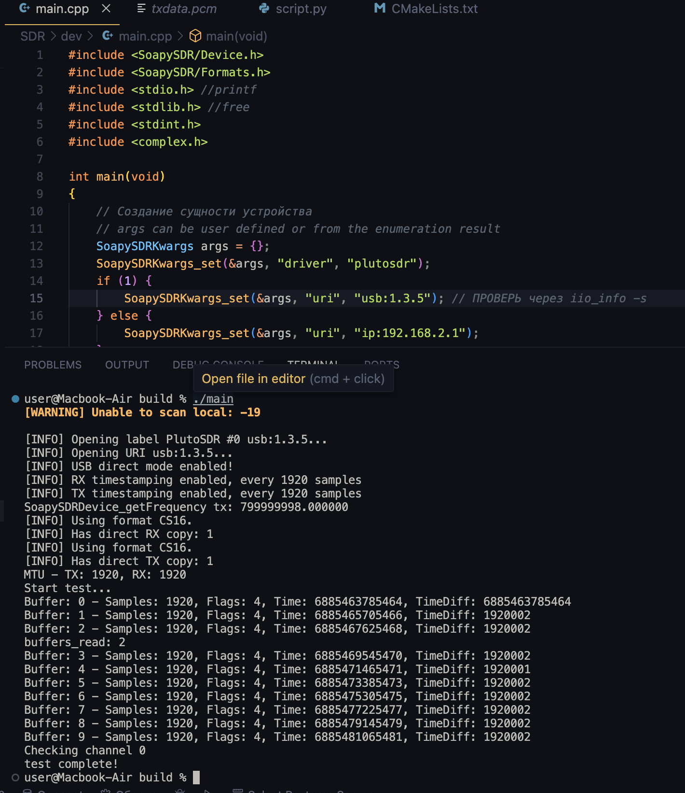
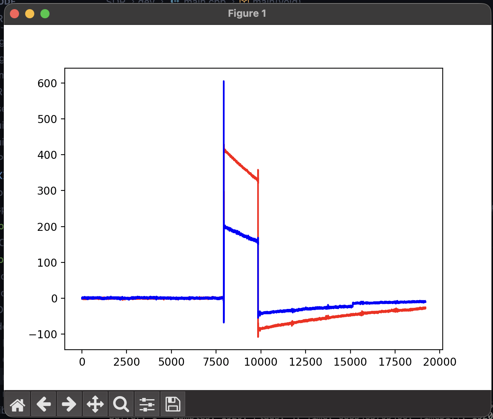
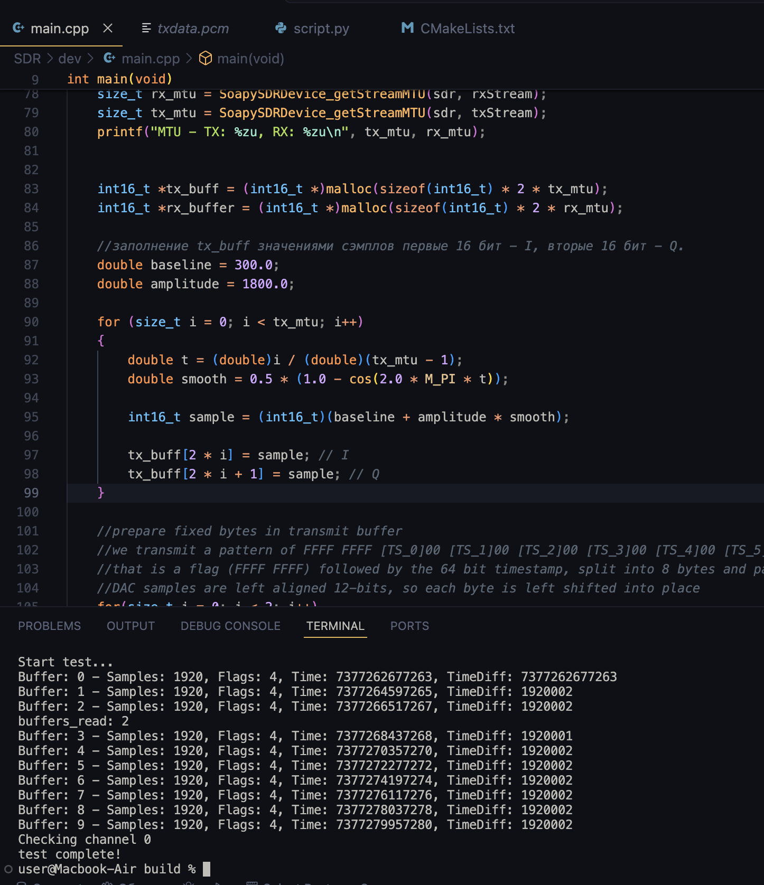
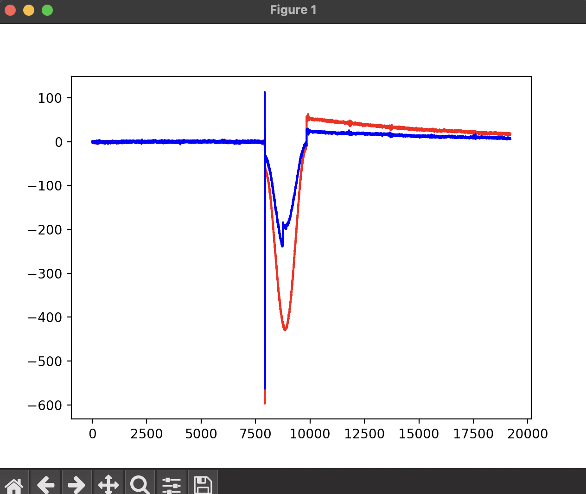

# Отчёт: Adalm Pluto SDR & Timestamp

## Цель работы

Освоить работу с SDR-платформой ADALM-PLUTO через библиотеку SoapySDR/libiio: настроить RX/TX потоки, реализовать передачу IQ-сэмплов с временными метками (timestamp) и проанализировать принятый сигнал.

## Теория

ADALM-PLUTO построен на связке радиочастотного приёмопередатчика **AD9363** (12-bit ADC/DAC, усилители, фильтры) и системы на кристалле **Xilinx Zynq 7000** (ARM Cortex A9 + FPGA). FPGA связывает прикладные процессоры с AD9363 и передаёт IQ-сэмплы приложениям через драйверы Linux (libiio).

Характеристики устройства:
- RF-диапазон: 325 МГц – 3.8 ГГц
- Полоса пропускания: до 20 МГц
- 12-bit ADC/DAC
- 1 передатчик, 1 приёмник (half/full duplex)
- Связь с хостом — USB 2.0 (реальная пропускная способность ниже теоретических 480 Mb/s из-за одновременной двусторонней передачи; рабочая частота дискретизации — ориентировочно до ~6 Msps)

## Стек и сборка

Использована библиотека **SoapySDR** (C API) с модулем **SoapyPlutoSDR** (форк с поддержкой timestamp), собранным из исходников.

```cmake
cmake_minimum_required(VERSION 3.16)
project(PlutoSDR CXX)
set(CMAKE_BUILD_TYPE Debug)
find_package(SoapySDR REQUIRED)
set(MAIN_SOURCE_FILES main.cpp)
add_executable(main ${MAIN_SOURCE_FILES})
target_link_libraries(main ${SoapySDR_LIBRARIES})
```

Устройство открывается с параметрами `driver=plutosdr`, `uri=usb:X.Y.Z`, `direct=1` (прямой доступ к USB-буферам) и `timestamp_every=1920` (кадр с меткой времени каждые 1920 сэмплов). Настройки: `sample_rate = 1 МГц`, `carrier_freq = 800 МГц`.

## Ход работы

### 1. Базовый запуск

Первый запуск выполнен со стандартным примером — TX-буфер заполнялся константой (`I = Q = 2000`), поток RX читался 10 раз по 1920 сэмплов, каждый буфер записывался в файл `txdata.pcm`. На 3-й итерации в TX-буфер записывался timestamp и отправлялся в эфир.

Лог подтвердил корректную работу timestamp-режима:

```
[INFO] USB direct mode enabled!
[INFO] RX timestamping enabled, every 1920 samples
[INFO] TX timestamping enabled, every 1920 samples
...
Buffer: 0 - Samples: 1920, Flags: 4, Time: 6885463785464, TimeDiff: 6885463785464
Buffer: 1 - Samples: 1920, Flags: 4, Time: 6885465705466, TimeDiff: 1920002
...
```

Разница времени между буферами стабильно равна ~1920002 нс, что соответствует частоте дискретизации 1 МГц (1920 сэмплов / 1 МГц ≈ 1920 мкс) — таймстампинг работает корректно.


*Рисунок 1 — лог запуска базовой версии: USB direct mode, RX/TX timestamping включены, буферы читаются с равным шагом по времени.*

Принятые данные визуализированы Python-скриптом (чтение `txdata.pcm` как пар int16 I/Q, построение графика). На графике виден служебный маркер-паттерн (`0xFFFF`) в момент передачи TX-буфера — резкий скачок амплитуды около индекса 8000–10000.


*Рисунок 2 — принятый сигнал (I — синий, Q — красный) при базовом заполнении TX-буфера константой.*

### 2. Задание: формирование заданной формы сигнала

По заданию преподавателя требовалось сформировать в TX-буфере не константу, а сигнал заданной формы (плавная кривая с одним периодом колебания — подъём/спад/подъём).

Заполнение буфера реализовано косинусоидой:

```cpp
double baseline = 300.0;
double amplitude = 1800.0;

for (size_t i = 0; i < tx_mtu; i++)
{
    double t = (double)i / (double)(tx_mtu - 1);
    double wave = cos(2.0 * M_PI * t); // один период: верх → низ → верх

    int16_t sample = (int16_t)(baseline + amplitude * wave);

    tx_buff[2 * i]     = sample; // I
    tx_buff[2 * i + 1] = sample; // Q
}
```


*Рисунок 3 — фрагмент `main.cpp` с формированием формы сигнала.*

После пересборки и повторного запуска в принятом сигнале отчётливо видна заданная плавная форма — провал в середине переданного буфера на фоне общего служебного маркера, что подтверждает корректную передачу и приём заданной формы сигнала через TX/RX тракт устройства.


*Рисунок 4 — принятый сигнал с заданной плавной формой (один период колебания) в середине буфера.*

## Выводы

- Настроен и протестирован полный цикл работы с ADALM-PLUTO через SoapySDR: инициализация устройства, настройка RX/TX потоков, передача и приём IQ-сэмплов.
- Подтверждена корректная работа режима timestamp: временные метки RX-буферов растут равномерно в соответствии с заданной частотой дискретизации.
- Реализовано и проверено формирование произвольной формы TX-сигнала (гармонической функции) вместо константного заполнения — форма сигнала подтверждена визуально по принятым RX-данным.
